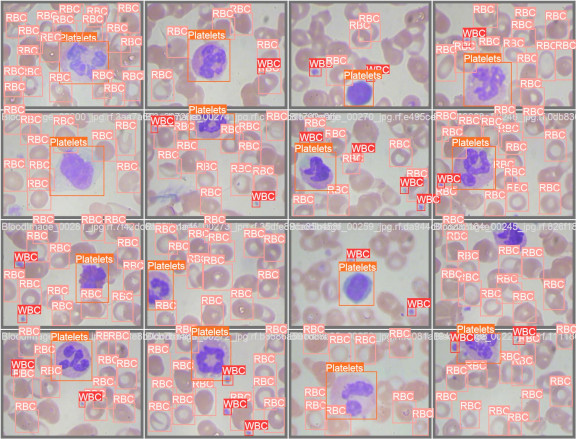

# YOLOv8 Python Implementation example
This repo is to test how easy is to use yolo v8 in python. The test is under [Cells dataset](https://www.kaggle.com/datasets/adhoppin/blood-cell-detection-datatset).




More in the [ultralytics](https://github.com/ultralytics/ultralytics) github.

## Installation

We recomend to start creating a virtual enviroment.

```bash
# macOS/Linux
# You may need to run sudo apt-get install python3-venv first
python3 -m venv .venv

# Windows
# You can also use py -3 -m venv .venv
python -m venv .venv
```

Upgrade pip to the latest version.

```bash
python.exe -m pip install --upgrade pip
```

If you want to use gpu install torch. An example for cuda 11.7, you can find the version for your gpu [here](https://pytorch.org/get-started/locally/)

```bash
pip install torch torchvision torchaudio --extra-index-url https://download.pytorch.org/whl/cu117
```
Use the package manager [pip](https://pip.pypa.io/en/stable/) to install yolov8. Pip install the ultralytics package including all [requirements.txt](https://github.com/ultralytics/ultralytics/blob/main/requirements.txt) in a
[**Python>=3.7.0**](https://www.python.org/) environment, including
[**PyTorch>=1.7**](https://pytorch.org/get-started/locally/).

```bash
pip install ultralytics
```

## Usage

There are two python scripts, [train.py](train.py) is from fine tune a yolov8 model and [test.py](test.py) is to test the model with an image.

More info in [ultralytics docs](https://docs.ultralytics.com/sdk/)

## Contributing

Pull requests are welcome. For major changes, please open an issue first
to discuss what you would like to change.

Please make sure to update tests as appropriate.

## License

[MIT](LICENSE)